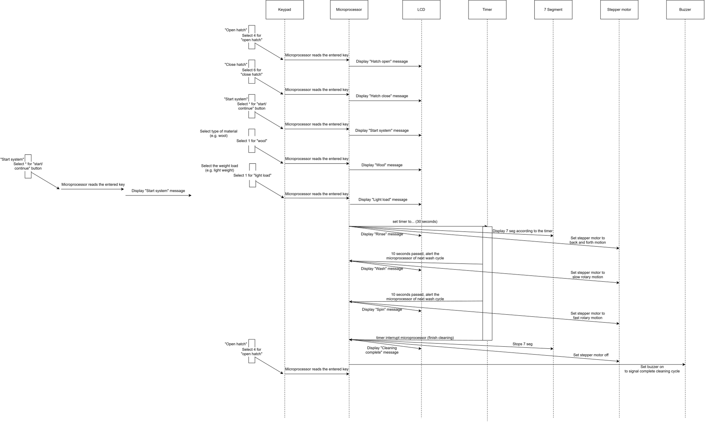
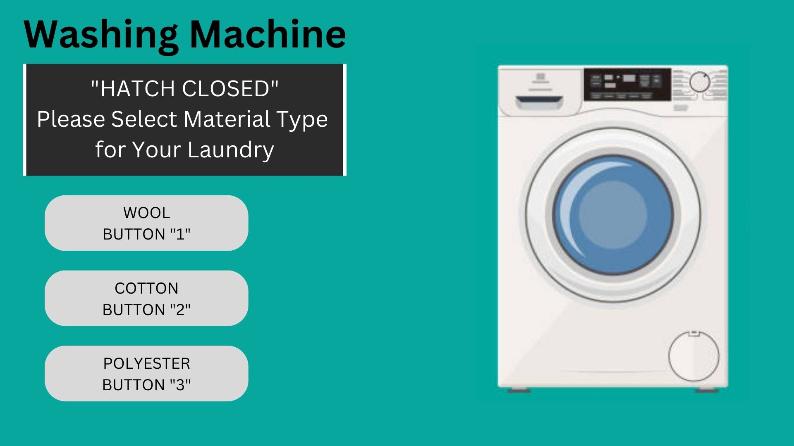

# 🫧 ECS Washing Machine Controller

> A microcontroller-based washing machine simulator that lets users select fabric type and automatically runs three optimised wash cycles — Rinse, Wash, and Spin — driven by a stepper motor with real-time LCD feedback and a completion melody.


---

## 📖 Overview

This project simulates the core logic of a domestic washing machine using embedded systems. Users interact with a **keypad** to open/close the hatch, select their fabric type, and start or pause the wash. A **stepper motor** physically simulates drum movement across three wash phases, while an **LCD** and **7-segment display** provide live feedback throughout the cycle.

The system adapts cycle duration based on the selected material — Wool, Cotton, or Polyester — ensuring each fabric type receives the appropriate wash intensity and duration.

---

## ✨ Features

| Feature | Description |
|---------|-------------|
| **Material selection** | Choose Wool, Cotton, or Polyester — cycle time adjusts automatically |
| **3-phase wash cycle** | Rinse (back & forth) → Wash (slow rotary) → Spin (fast rotary) |
| **Live countdown** | 7-segment display counts down each cycle phase |
| **LCD status display** | Shows current state at every step (hatch open/closed, cycle running, done) |
| **Pause & resume** | Pause mid-cycle, open hatch to add clothes, then continue |
| **Safety: accidental hatch** | If hatch is opened during wash, system pauses automatically |
| **Completion melody** | Buzzer plays a tune when all cycles are complete |
| **Restart option** | User can restart the entire program after cycle completes |

---

## 🎛️ Keypad Layout

```
┌───────────┬───────────┬───────────┐
│   Wool    │  Cotton   │ Polyester │
│   [1]     │   [2]     │   [3]     │
├───────────┼───────────┼───────────┤
│   Open    │  Close    │           │
│   Hatch   │  Hatch    │   [6]     │
│   [4]     │   [5]     │           │
├───────────┼───────────┼───────────┤
│           │  Start /  │   Pause   │
│   [7]     │ Continue  │   [9]     │
│           │   [8]     │           │
├───────────┼───────────┼───────────┤
│   [*]     │   [0]     │   [#]     │
└───────────┴───────────┴───────────┘
```

---

## 🔧 Hardware Components

| Component | Role |
|-----------|------|
| **Microcontroller** | Main control unit — reads keypad, drives all outputs |
| **4×3 Matrix Keypad** | User input for hatch, material, start, pause |
| **LCD Display** | Shows status messages at each stage |
| **Stepper Motor** | Simulates drum — back/forth, slow rotary, fast rotary |
| **7-Segment Display** | Countdown timer per wash phase (30s per cycle) |
| **Buzzer / Speaker** | Plays completion melody at end of cycle |

---

## ⚙️ System Architecture

```
┌──────────────────────────────────────────────────────┐
│                   Microcontroller                    │
│                                                      │
│   INPUTS                          OUTPUTS            │
│   ┌──────────────┐                ┌───────────────┐  │
│   │ 4×3 Keypad   │───────────────▶│ LCD Display   │  │
│   │              │                │ 7-Seg Timer   │  │
│   └──────────────┘                │ Stepper Motor │  │
│                                   │ Buzzer        │  │
│                                   └───────────────┘  │
└──────────────────────────────────────────────────────┘
```

---

## 🔄 Wash Cycle Flow

```
Power On → Welcome message displayed
      │
      ▼
[4] Open Hatch → Load laundry
      │
      ▼
[5] Close Hatch
      │
      ▼
[1/2/3] Select Material (Wool / Cotton / Polyester)
      │
      ▼
[8] Start → Cleaning begins
      │
      ├──▶ RINSE  — Motor: back & forth    │
      ├──▶ WASH   — Motor: slow rotary     │ 7-seg counts down per phase
      └──▶ SPIN   — Motor: fast rotary     │
      │
      ▼
"CLOTHES DONE CLEANING" + Buzzer melody
      │
      ▼
[4] Open Hatch → Unload laundry → Restart?
```

**Pause at any time with [9]** — timer and motor freeze. Open hatch if needed, close, then press [8] to resume exactly where it left off.

---

## 🖼️ System Design

**Use Case Diagram — Normal Flow**



**Use Case Diagram — Adding Clothes (Pause & Resume)**



**Interaction Diagram**



**Hardware Configuration — LT1 Dip Switch**


---

## 📸 Demo



*Graphical User Interface (GUI)*

---

## 📂 Repository Structure

```
Washing_machine_microcontroller/
├── demo/                              # Photos and demo media
├── system_design/
│   ├── Interaction.svg                # System interaction sequence diagram
│   ├── Interaction.drawio             # Editable source
│   ├── UseCase_Normal.svg             # Normal use case diagram
│   ├── UseCase_Normal.drawio          # Editable source
│   ├── UseCase_add_clothes.svg        # Add clothes / pause use case diagram
│   ├── UseCase_add_clothes.drawio     # Editable source
│   └── LT1 Dip Switch Config.jpg     # Hardware dip switch configuration
├── ECS Washing Machine.pdf            # Full project report
└── README.md
```

---

## 🚀 How to Run

1. Flash the firmware to the target microcontroller using your IDE (e.g. MPLAB X / Keil)
2. Wire up components as per the circuit schematic in `system_design/`
3. Power on — LCD displays **"WELCOME"**
4. Follow the [User Guide](#-wash-cycle-flow) above

---

## 👥 Team

| Name | Contribution |
|------|-------------|
| **Stanley Lin** | Coding (50%), Report (33%) |
| **Wai Yan Aung** | Coding (50%), Report (33%) |
| **Melinda** | Report (33%) |

> Developed for the **Embedded Computer Systems (ECS)** module at **Singapore Polytechnic**, June 2023.
> Lecturer: Mr Ilyas

---

## 📄 Report

The full system design report — including use case diagrams, interaction diagrams, subsystem analysis, and user manual — is available here:

📎 [ECS Washing Machine.pdf](ECS%20Washing%20Machine.pdf)
